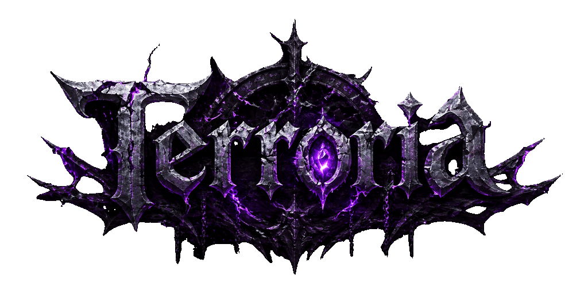

<div align="center">
  <h1>Terroria</h1>
</div>




> **GAS 기반 탑다운 액션 RPG** — 언리얼 엔진 5로 구현된 멀티플레이 지원 RPG Game

📹 Youtube: [Link](https://www.youtube.com/watch?v=iabD4uI2ZHE)

---

## 📖 프로젝트 소개

**Terroria**는 언리얼 엔진 5의 **Gameplay Ability System(GAS)** 을 핵심 골격으로 삼아 설계된 탑다운 액션 RPG입니다.

클릭-투-무브 방식의 조작, 퀘스트·대화·상점 시스템, 행동 트리 기반 AI, 멀티플레이 복제(Replication) 아키텍처까지 — RPG 장르를 구성하는 주요 시스템을 모두 C++로 직접 구현하였습니다. 또한 블루프린트 확장성을 염두에 두고 설계되어, 디자이너와 프로그래머 모두가 유연하게 콘텐츠를 추가할 수 있습니다.

> **Notice**: 소스코드만 업로드 되어있습니다. 리소스 파일은 제공하지 않습니다.
---

## ✨ 주요 특징 (Key Features)

### 🧩 GAS 완전 통합 능력 시스템
- `UTGameplayAbility` 기반 커스텀 어빌리티 클래스와 **동적 쿨다운 관리** (`MMC_CooldownReduction`)
- `ExecutionCalc_Damage` — 물리/마법 데미지 타입, 치명타, 방어 감소 공식이 적용된 커스텀 데미지 실행 계산
- 어빌리티 입력 버퍼(`GameplayInputQueueSystem`) — 공격 중 다음 스킬 입력을 큐에 저장했다가 타이밍에 맞춰 자동 실행
- `AbilityTask_TargetDataUnderMouse` — 마우스 커서 기반 타겟 데이터를 서버에 안전하게 복제

### 🧠 행동 트리(BT) 기반 AI
- **감지 → 추격 → 공격 → 귀환** 상태를 GameplayTag로 관리하는 상태 머신
- 커스텀 BT 서비스/태스크/데코레이터 (`BTService_UpdateCombatContext`, `BTTask_SetStateTag`, `TDecorator_HasGameplayTag`)
- Leash 시스템 — 지정 반경 이탈 시 자동으로 홈으로 귀환, Wander/Search 등 자연스러운 순찰 행동

### 💬 대화 시스템 (Dialogue System)
- 노드 기반 분기 대화 (`DialogueManagerSubsystem`)
- **조건부 대화** — 퀘스트 상태, GameplayTag, 대화 이력 등 다양한 조건을 복합 평가
- 대화 이벤트 — 대화 중 퀘스트 수락, 아이템 지급, 목표 완료 등을 직접 트리거

### 📋 퀘스트 시스템 (Quest System)
- `QuestManagerSubsystem` (GameInstance 서브시스템) — 게임 전반의 퀘스트 상태를 단일 진실 공급원으로 관리
- 선행 퀘스트(Chain Quest), 시간 제한, NPC 보고 방식 등 다양한 퀘스트 유형 지원
- `QuestGiverComponent` / `QuestReceiverComponent` — NPC와 플레이어를 느슨하게 결합하는 컴포넌트 분리 구조
- GameplayTag 기반 일괄 목표 업데이트 (`UpdateObjectiveByTag`)

### 🏪 상점 시스템 (Shop System)
- `DataTable` 기반 아이템 정의 — `FShopItemTableRow`로 에디터에서 비용 곡선(ScalableFloat)을 직접 설정
- 스킬 업그레이드 / 어트리뷰트 강화 두 가지 카테고리 지원
- `TShopComponent` + `TShopWidgetController` — MVC 패턴으로 UI와 로직을 분리

### 📡 멀티플레이 복제 (Multiplayer Replication)
- 플레이어 스탯(`Level`, `XP`, `Gold`, `AttributePoint`) 서버 권한 복제
- 어빌리티 시스템 복제 모드 분리 — 플레이어는 `Mixed`, NPC/Enemy는 `Minimal`
- 레벨업 파티클, 플래시 스킬 이펙트 등 `NetMulticast` 처리

### 🎯 클릭-투-무브 컨트롤러
- `NavigationSystem` 기반 경로 탐색 + `SplineComponent` 스무딩
- 커서 하이라이트 인터페이스 (`IHighlight`) — 적, 아이템, NPC 커서 타입 자동 전환
- 짧은 클릭은 이동, 긴 클릭(Hold)은 연속 추적으로 자동 분기

---

## 🛠️ 기술 스택 (Tech Stack)

| 분류 | 내용 |
|------|------|
| **엔진** | Unreal Engine 5.6 |
| **언어** | C++ 17 |
| **핵심 플러그인** | Gameplay Ability System (GAS), Enhanced Input, AI Module, Niagara |
| **내비게이션** | NavigationSystem V1 (NavMesh) |
| **UI 프레임워크** | UMG + 커스텀 WidgetController (MVC 패턴) |
| **데이터 관리** | DataAsset, DataTable, ScalableFloat Curve |
| **네트워크** | 언리얼 엔진 내장 복제 시스템 (Listen Server 기반) |

---

## 📁 프로젝트 구조

```
Source/Terroria/
├── AbilitySystem/          # GAS 핵심 — 어빌리티, 어트리뷰트, 이펙트 계산
│   ├── Abilities/          # BlackHole, Shield, ShockWave 등 개별 스킬
│   ├── AsyncTask/          # WaitCooldownChange 등 비동기 태스크
│   ├── Component/          # GameplayInputQueueSystem (입력 버퍼)
│   ├── Data/               # DataAsset — 캐릭터 클래스, 레벨업, 어빌리티 정의
│   ├── ExecCalc/           # ExecutionCalc_Damage (데미지 계산)
│   └── MMC/                # MaxHealth, MaxMana, CooldownReduction MMC
├── AI/                     # 행동 트리 서비스/태스크/데코레이터
│   ├── Decorator/
│   ├── Service/
│   └── Task/
├── Character/              # 플레이어 / 적 / NPC 캐릭터 클래스
├── DialogueSystem/         # 대화 서브시스템 및 컴포넌트
├── Game/                   # GameMode, SoundManagerSubsystem
├── Input/                  # Enhanced Input 매핑 및 입력 컴포넌트
├── Player/                 # PlayerController, PlayerState, ShopComponent
├── QuestSystem/            # 퀘스트 서브시스템, 컴포넌트, 데이터 타입
└── UI/                     # HUD, WidgetController (Overlay, Shop, AttributeMenu)
```
---

## 🏗️ 핵심 아키텍처

```
[TPlayerController]
    │── Enhanced Input ──► AbilityInputTag ──► UTAbilitySystemComponent
    │── Click-to-Move ──► NavigationSystem ──► SplineComponent
    └── Interaction(F) ──► IInteractable::Execute_Interact()

[GAS Flow]
    Input ──► HeldAbilityInputTag() ──► TryActivateAbility()
           └► InputQueueSystem ──► (버퍼) ──► TryActivateBufferedAbility()

[Quest Flow]
    NPC(QuestGiverComponent) ──► OfferQuest()
        └──► QuestManagerSubsystem::AcceptQuest()
                 └──► OnQuestStatusChanged (Delegate)
                          └──► QuestReceiverComponent ──► UI

[Damage Flow]
    Ability ──► GameplayEffect ──► ExecutionCalc_Damage
                                       └──► IncomingDamage (MetaAttribute)
                                                └──► PostGameplayEffectExecute()
                                                         └──► Die() / XP Event
```

---

## 📝 Todo

### 게임플레이
- [ ] **보스 페이즈 시스템** — HP 임계값마다 행동 패턴과 BGM이 전환되는 다단계 보스 전투
- [ ] **상태이상 시스템 확장** — 기절·빙결·출혈 등 GE 스택 기반 디버프 추가

### AI
- [ ] **동적 난이도 조절** — 플레이어 레벨·사망 횟수에 따라 AI 스탯과 어그로 범위를 자동 조정

### 멀티플레이
- [ ] **전용 서버(Dedicated Server) 지원** — 현재 Listen Server 구조에서 DS 빌드로 전환
- [ ] **세션 시스템** — Online Subsystem을 활용한 방 생성·참여·로비 UI

### 🗺️ 콘텐츠
- [ ] **월드 맵 & 지역 이동** — 지역별 씬 스트리밍 및 미니맵 UI

### 🛠️ 개발 환경 & 품질
- [ ] **다이얼로그 에디터 유틸리티** — 퀘스트·대화 데이터를 에디터 내에서 시각적으로 편집하는 커스텀 툴
- [ ] **성능 프로파일링** — Insights 기반 네트워크 복제 비용 측정 및 최적화

---

## 📜 LICENSE

Copyright 2025 **@xerlock**. All Rights Reserved.

본 프로젝트의 소스 코드 및 에셋은 저작권법의 보호를 받습니다. 허가 없는 복제, 배포, 수정을 금합니다.

---

<div align="center">
  <sub>Built with using Unreal Engine 5 & GAS</sub>
</div>
